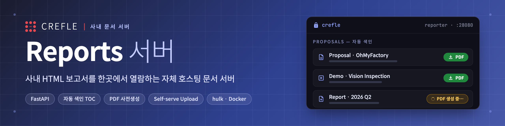

<p align="center">
  
</p>

# CREFLE Reports 서버

`proposals/` 에 보관된 HTML 보고서를, 자동 생성되는 목차(TOC)와 함께 열람할 수 있는 자체 HTML 서버입니다.
기존 GitHub Pages 게시 방식을 대체합니다.

- **언어/프레임워크**: Python · FastAPI + uvicorn
- **목차 자동 생성**: 서버가 `proposals/` 폴더를 스캔해 매 요청마다 최신 목록을 만듭니다. 문서를 추가해도 색인을 손볼 필요가 없습니다.
- **접근 제한**: 사람은 `/login` 으로 로그인해 JWT 쿠키를 받고 `/logout` 으로 로그아웃합니다. 자동화/CLI(`register_report.sh` 등)는 `Authorization: Basic` 헤더로 계속 접근합니다(하이브리드).

## 설치

```bash
cd /Users/rangkim/projects/crefle/reports
python3 -m venv .venv
source .venv/bin/activate
pip install -r requirements.txt
```

## 실행

```bash
# (권장) 운영용 자격증명을 환경변수로 설정
export REPORTS_USER="crefle"
export REPORTS_PASS="원하는_강한_비밀번호"

python3 server.py
```

- 기동되면 `0.0.0.0:8000` 으로 바인딩됩니다.
- 같은 네트워크의 동료는 브라우저에서 `http://<서버-IP>:8000` 으로 접속합니다(접속 시 아이디/비밀번호 입력).
- 내 IP 확인: `ipconfig getifaddr en0` (macOS).

## 환경변수

| 변수 | 기본값 | 설명 |
|---|---|---|
| `REPORTS_USER` | `crefle` | Basic Auth 사용자명 |
| `REPORTS_PASS` | `crefle` | Basic Auth 비밀번호 — **운영 시 반드시 변경** |
| `REPORTS_SECRET_KEY` | (임시 키) | JWT 서명 키 — **운영 시 반드시 강한 무작위 값**(`openssl rand -hex 32`) |
| `REPORTS_TOKEN_TTL` | `1209600` | 로그인 토큰 수명(초, 14일) |
| `REPORTS_COOKIE_SECURE` | `0` | TLS 뒤에서 `1` |
| `HOST` | `0.0.0.0` | 바인딩 주소 (개인 PC 전용이면 `127.0.0.1`) |
| `PORT` | `8000` | 포트 |
| `REPORTS_DOCS_DIR` | `proposals` | 문서 루트(서버 위치 기준 상대 경로) |

> `REPORTS_PASS` 를 설정하지 않으면 기본값으로 기동하며 시작 로그에 경고가 출력됩니다.

## 동작 방식

- `GET /` → `proposals/` 를 스캔해 목차 페이지를 동적 생성. 폴더별로 묶고 그룹 내 최신순 정렬.
- `GET /<경로>` → 문서·에셋 파일 제공. **`proposals/` 범위 밖**(예: `server.py`, `.git`)이나 경로 트래버설은 404.
  문서의 상대 에셋(`colors_and_type.css`, `assets/…svg`, 폰트 등)이 디렉터리 구조 그대로 로드됩니다.

## 문서 추가

`proposals/` 하위에 `.html` 파일을 두면 자동으로 목차에 나타납니다(서버 재시작 불필요).
새 폴더의 섹션 이름을 예쁘게 표시하려면 `server.py` 의 `GROUP_LABELS` 에 매핑을 추가하세요.

## 지속 실행 (선택)

- 빠른 백그라운드 실행: `nohup python3 server.py > server.log 2>&1 &`
- macOS 상시 운영: `launchd` (`~/Library/LaunchAgents/*.plist`)
- Linux 서버 운영: `systemd` 서비스 유닛
- 인터넷 공개가 필요하면 앞단에 `nginx`/`Caddy` 리버스 프록시로 HTTPS·도메인 연결(이번 범위 밖).

## 운영 배포 (hulk · Docker)

상시 운영은 **hulk 서버에서 Docker Compose**로 한다.

- 서버: `ssh hulk@192.168.1.111` (docker 그룹, sudo 불필요)
- 배포 위치: `/home/hulk/working/reporter.crefle.com/`
- 이미지: 뷰어 `hub.crefle.com/service/reporter:1.5` + 렌더러 `hub.crefle.com/service/reporter-renderer:1.1` (둘 다 linux/amd64)
- 접속: `http://192.168.1.111:28080` (로그인 `crefle`/`crefle`, `.env`로 변경)
- 리포트는 이미지에 굽지 않고 `./proposals → /app/proposals:ro` **bind mount**로 주입한다.
  `discover_documents()`가 매 요청 스캔이므로 **파일을 추가하면 재시작 없이 즉시 반영**된다.

### 이미지 빌드 + push (로컬, arm64 → amd64 크로스빌드)
```bash
docker buildx create --name crefle-builder --driver docker-container --bootstrap --use 2>/dev/null || docker buildx use crefle-builder
# 뷰어(lean, Chromium 없음)
docker buildx build --platform linux/amd64 -t hub.crefle.com/service/reporter:1.5 --push .
# 렌더러(Chromium 워커)
docker buildx build --platform linux/amd64 -f Dockerfile.renderer -t hub.crefle.com/service/reporter-renderer:1.1 --push .
```
> 코드 변경 시에만 태그를 올리고 compose의 `image:`를 갱신한다. 리포트/업로드 콘텐츠 변경은 마운트라 재빌드 불필요.

### 배포 / 기동 (hulk)
```bash
D=/home/hulk/working/reporter.crefle.com
ssh hulk@192.168.1.111 "mkdir -p $D/uploads/docs $D/uploads/queue/done $D/uploads/tmp"  # 업로드 볼륨(최초 1회)
# uploads 는 렌더러 pwuser(uid 1001) 소유여야 한다(뷰어도 compose에서 user 1001 로 실행).
# 호스트 비루트는 다른 uid 로 chown 불가 → 루트 컨테이너로 한 번 맞춘다:
ssh hulk@192.168.1.111 "docker run --rm --user 0:0 --entrypoint chown -v $D/uploads:/u hub.crefle.com/service/reporter:1.5 -R 1001:1001 /u"
scp docker-compose.yml .env.example hulk@192.168.1.111:$D/
ssh hulk@192.168.1.111 "cd $D && cp -n .env.example .env"   # 최초 1회 — .env 의 REPORTS_UPLOAD_PASS, REPORTS_SECRET_KEY 를 강한 값으로 설정
ssh hulk@192.168.1.111 "cd $D && docker compose pull && docker compose up -d"
```
> `REPORTS_UPLOAD_PASS`, `REPORTS_SECRET_KEY` 미설정이면 compose 가 기동하지 않는다(fail-closed). `REPORTS_SECRET_KEY` 는 `openssl rand -hex 32` 로 생성. `uploads/` 는 git·rsync 미러가 아니므로 **별도 백업** 필요.

### 리포트 추가/갱신 (재빌드·재시작 불필요)
git repo의 `proposals/`가 소스. 편집 후 hulk로 동기화만 하면 된다.
```bash
rsync -az --delete proposals/ hulk@192.168.1.111:/home/hulk/working/reporter.crefle.com/proposals/
```
> 새 폴더의 목차 섹션명을 예쁘게 하려면 `server.py`의 `GROUP_LABELS`만 수정(이건 코드 변경 → 재빌드, 선택).

## PDF 다운로드 (사전생성)

각 문서의 PDF를 **미리 생성**해 `proposals/<문서>.pdf` 로 함께 보관하고, 목차 카드의 **⬇ PDF**
버튼으로 내려받는다(정적 제공). 운영 컨테이너는 그대로 가볍게 유지된다(렌더링은 빌드/등록 머신에서만).

- **엔진**: Playwright + Chromium (JS 구동 덱·최신 CSS 충실 렌더). 덱(`deck-stage.js`)은 내장 `@media print`로 슬라이드당 1페이지(1920×1080), 일반 문서는 A4 자동 페이지네이션.
- **인터랙티브 데모**: 캡처 전 재생/스크롤을 자동 트리거해 콘텐츠(차트·분석표 등)를 펼친 뒤 PDF화.
- **최신성**: PDF가 원본 HTML보다 오래되면 목차 버튼이 흐리게 표시되고, 재생성 시 자동 갱신.

도구 설치(빌드/등록 머신, 최초 1회):
```bash
pip install -r tools/requirements-pdf.txt
python -m playwright install chromium
```
생성/갱신:
```bash
python tools/render_pdf.py --all            # 누락·오래된 것만 생성
python tools/render_pdf.py --all --force    # 전부 재생성
python tools/render_pdf.py <html>           # 단일 문서
```
> 신규 리포트 등록 시 `register-report` 하네스가 PDF를 **자동 생성**한다(`--no-pdf`로 생략 가능).
> 생성된 PDF는 `proposals/`에 들어가므로 hulk 동기화(rsync) 시 함께 배포된다.

## 웹 업로드 (self-service · M1)

`/upload` 에서 HTML 보고서(.html) 또는 자산 포함 묶음(.zip)을 올리면 **즉시 게시**되고 PDF가 자동 생성된다.

- 접근: 목차 우측 **+ 업로드** → `/upload`. 읽기와 **별도의 쓰기 자격증명**(`REPORTS_UPLOAD_USER/PASS`)이 필요.
- 입력: 문서 유형 · 이름 · 버전 · 파일. 경로는 서버가 생성(`uploads/docs/<type>/<이름>_v<버전>/index.html`).
- 자산 있는 문서는 `index.html` 포함 **.zip** 으로(zip-slip·zip-bomb·심볼릭링크·확장자 검증).
- **macOS/Windows 탐색기 zip 자동 정리**: Finder '폴더 압축'이 끼워넣는 `__MACOSX/`·`.DS_Store`·`._*`(AppleDouble)나 `Thumbs.db`·`desktop.ini` 메타데이터는 추출 시 자동 스킵된다(이전엔 `.DS_Store`의 빈 확장자가 업로드를 거부시켰음). 내용물을 단일 폴더로 감싼 zip은 그 폴더를 자동 평탄화해 `index.html`을 최상위로 끌어올린다 → **그냥 압축해서 올리면 된다.**
- 게시 즉시 목차 노출("PDF 생성 중…") → 렌더러 워커가 PDF 생성 후 **⬇ PDF** 버튼 활성.
- 소스 오브 트루스 = **`uploads/` 볼륨**(git 아님). 기존 git 문서와 별도 트리 → `rsync --delete proposals/` 영향 없음.
- 아키텍처: 뷰어(lean)가 업로드 수신·게시, **격리 렌더러 워커**(Chromium·`network_mode:none`)가 `uploads/queue/` 를 소비해 PDF 생성.

**보안/범위(M1)**: 업로드 HTML 은 활성 콘텐츠다. nosniff·CSP(`connect-src 'none'` 등)·격리 렌더러·감사 로그(`uploads/audit.log`)를 적용하되, **공유 자격증명·동일 출처**라는 구조적 위험이 남는다 → **LAN 전용** 전제. 실사용자 인증(Google OAuth)은 M2, 공개 노출 시 별도 출처·TLS 는 M3 (그 전에는 공개 프록시 금지).

## uploads 백업 (hulk 2nd disk)

`uploads/` 는 git·rsync 미러가 아니므로 별도 백업한다. hulk 의 2nd disk(`/home/storage_disk2`)에 **매일 tar 스냅샷(14일 회전)**. 스크립트: `ops/backup-uploads.sh`.

```bash
# 최초 1회: 스크립트 설치 + cron 등록
scp ops/backup-uploads.sh hulk@192.168.1.111:/home/hulk/working/reporter.crefle.com/
ssh hulk@192.168.1.111 "chmod +x /home/hulk/working/reporter.crefle.com/backup-uploads.sh"
ssh hulk@192.168.1.111 '(crontab -l 2>/dev/null | grep -v backup-uploads.sh; echo "0 3 * * * /home/hulk/working/reporter.crefle.com/backup-uploads.sh >> /home/storage_disk2/reporter-backup/backup.log 2>&1") | crontab -'
```
복구: `tar xzf /home/storage_disk2/reporter-backup/uploads-<날짜>.tar.gz -C <복구위치>`.
> 동일 호스트 백업이라 **실수 삭제·루트디스크 손실엔 대비**되나 호스트 자체 손실엔 취약. 오프사이트(예: Google Drive)는 추후 보강(M4).

## 보안 강화 (보류 · 우선순위 낮음)

**LAN 전용 운영을 유지하는 한 보류**한다(기능 우선, 2026-06-18 결정). 단, **공개 노출(리버스 프록시·도메인)을 붙이기 전에는 반드시 선행**해야 한다.

- **M2 — 실사용자 인증**: 현재 업로드는 공유 자격증명(`REPORTS_UPLOAD_PASS`)으로만 보호. `server.py` 의 `require_uploader()` **한 곳**을 Google Workspace OAuth(OIDC, hd=crefle.com, 서명 세션쿠키)로 교체 → 호출부 변경 없이 per-user 인증·감사(audit.log 가 IP→이메일)로 격상.
- **M3 — 공개 노출 하드닝**: 인터넷 공개 시 nginx/Caddy TLS + **업로드 콘텐츠 별도 출처(서브도메인/포트)** 서빙으로 동일출처 stored-XSS·자격증명 라이딩 차단.
- 잔여 위험(현재 수용): 업로드 HTML 은 활성 콘텐츠 → 동일출처·공유 자격증명 하의 구조적 위험. **LAN 전용 전제로만 수용**.

## 향후 추가 예정 기능 (로드맵)

### 1. 문서별 다운로드 기능
- **PDF 다운로드 (필수)** — ✅ **구현됨**. 자세한 내용은 위 "PDF 다운로드(사전생성)" 섹션 참조.
- **PPT 다운로드 (선택)** — 동일 문서를 PPTX로 내보내기.
  - HTML→PPTX는 정형 변환이 어려움. 슬라이드 덱은 슬라이드별 이미지 캡처 후 PPTX 임베드, 또는 원본 PPTX를 함께 보관하는 방식 검토.

### 2. HTML 문서 업로드 기능 — ✅ M1 구현됨 (위 "웹 업로드" 섹션 참조)
- 현재 등록은 내부망 rsync/`register-report` 하네스로 수행. 이를 **웹 UI 업로드**로 확장.
  - 기능: 로그인 후 화면에서 `.html`(및 자산) 업로드 → 유형·이름·버전 입력 → `proposals/` 반영.
  - 고려사항: 인증/권한 강화(현재 Basic Auth는 평문·공용), 업로드 검증(파일형식·크기·자산 동반), bind mount가 `:ro`이므로 쓰기 경로 분리 필요, 동시성/중복 처리.
  - 하네스의 `register_report.sh` 로직을 서버 측 업로드 핸들러로 재사용 가능.
